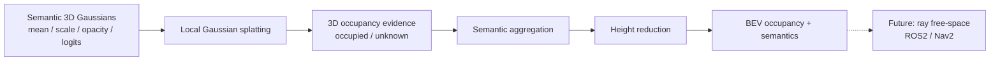
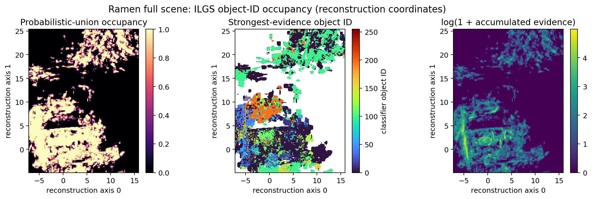
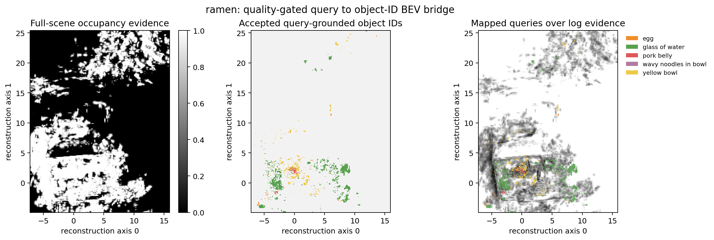
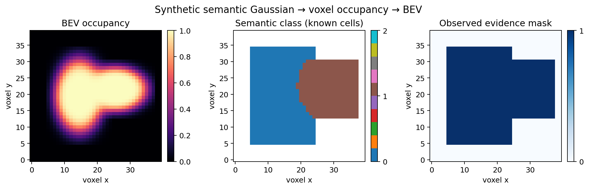

# Gaussian OCC Bridge

[](https://github.com/o1yaya/gaussian_occ_bridge/actions/workflows/tests.yml)


一个面向机器人感知的最小可运行基线：将带语义的 3D Gaussians 转换为体素占据表示，并进一步聚合为鸟瞰图（BEV）。项目当前重点是把 3DGS 重建结果连接到 BEV/OCC 下游，而不是声称已经完成自由空间预测或导航系统。

> A small, testable reference bridge from semantic 3D Gaussians to voxel occupancy and BEV representations for robot perception.

## 30-second overview



The current NumPy implementation uses diagonal covariance, local `3σ` support, probabilistic-union occupancy, and evidence-weighted semantic fusion. It is intentionally correctness-oriented and CPU-only.

## Visible result

### Full-scene object-ID semantic occupancy

The complete ILGS `ramen` PLY contains 854,507 Gaussians and a 256-way object
classifier. A memory-bounded CPU run keeps the 200,000 highest-opacity Gaussians after
scale/opacity filtering and produces hard-label semantic occupancy for 47 active object IDs:



| Item | Result |
|---|---:|
| Source Gaussians | 854,507 |
| Bounded run budget | 200,000 |
| Gaussian centers inside robust grid | 192,157 |
| Active classifier object IDs | 47 |
| Voxel grid | 231 × 303 × 217 |
| Total voxels | 15,188,481 |
| Load and classify | 2.28 s |
| CPU splat and BEV reduction | 10.86 s |

To avoid a dense `[X,Y,Z,256]` tensor, each voxel receives the object ID of the
individual Gaussian with the strongest local evidence. Occupancy still uses probabilistic
union. This is a memory-efficient reference baseline, not equivalent to full per-class
evidence accumulation. See
[`docs/full_scene_semantic_result.md`](docs/full_scene_semantic_result.md).

### Open-vocabulary query bridge

Six language queries were processed by ILGS multi-view query-mask voting and isolated
Gaussian export. A mask/overlay quality gate accepts five queries mapped to 12 classifier
object IDs and rejects `chopsticks` before projection onto the bounded full-scene BEV:



| Accepted query | Object IDs | Query-export Gaussians | BEV cells |
|---|---|---:|---:|
| egg | 107, 109, 123, 238 | 14,529 | 95 |
| glass of water | 53, 75, 129, 141 | 57,004 | 1,268 |
| pork belly | 120, 212 | 18,223 | 48 |
| wavy noodles in bowl | 28 | 9,563 | 28 |
| yellow bowl | 108 | 51,582 | 506 |

The 12 accepted assignments do not overlap and all are visible in this 200k-Gaussian run.
Together they cover 1,945 of 36,196 BEV cells with evidence (5.37%). These are
query-grounded ID mappings, not a trained human-category classifier or semantic OCC
accuracy result. See
[`docs/ramen_named_query_bev.md`](docs/ramen_named_query_bev.md).

`chopsticks` is rejected rather than merely hidden: one view supplies 175,751 pixels, or
95.39% of all query-mask pixels, and visibly covers broad table/background regions.
Removing dominant ID 1 still highlights unrelated cups and a distant noodle plate, so the
remaining IDs are not promoted as a clean mapping.

### Real ILGS query export

The adapter was run on an 18,223-Gaussian `pork belly` query export from the ILGS
`ramen` scene. The figure shows occupancy evidence in **reconstruction coordinates**:


| Item | Result |
|---|---:|
| Source Gaussians | 18,223 |
| After opacity/scale filtering | 14,919 |
| Gaussian centers inside robust grid | 14,726 |
| Voxel grid | 85 × 73 × 67 |
| Occupied voxels (`p ≥ 0.5`) | 44,097 |
| Voxels with Gaussian evidence | 183,918 |
| BEV cells with evidence | 5,574 |

Probabilistic union saturates in dense regions, as visible in the upper-right panel. This
is occupancy **evidence**, not a calibrated OCC probability or navigation-ready map. See
[`docs/real_ilgs_result.md`](docs/real_ilgs_result.md) for the frozen filtering protocol,
input hash and limitations.

### Deterministic synthetic smoke test



| Item | Result |
|---|---:|
| Input Gaussians | 2 |
| Voxel grid | 40 × 40 × 30 |
| Occupied voxels (`p ≥ 0.5`) | 649 |
| Voxels with Gaussian evidence | 18,712 |
| BEV cells with evidence | 834 |
| Maximum voxel occupancy | 0.898878 |

These values validate the data path; they are not public-dataset accuracy claims.

## Representation contract

Input:

```text
mean               [N, 3] world or reconstruction coordinates
scale              [N, 3] standard deviations for the CPU reference
opacity            [N]
semantic_logits    [N, C]
```

Output:

```text
occupancy          [X, Y, Z] probabilistic union of Gaussian evidence
semantic_probs     [X, Y, Z, C]
evidence           [X, Y, Z]
unknown_mask       [X, Y, Z]
BEV occupancy      [X, Y]
BEV semantics      [X, Y, C]
```

Important boundary: Gaussians provide **occupied-space evidence**, but do not prove that an unobserved cell is free. Low-evidence cells are therefore marked unknown. Free-space labels require calibrated camera/depth rays or another visibility model.

## Quick start

```bash
python -m pip install -e .
python -m unittest discover -s tests -v
python scripts/run_demo.py
```

To rebuild the figure:

```bash
python -m pip install -e ".[visualization]"
python scripts/run_demo.py
python scripts/visualize_demo.py
```

PowerShell users can also run the source directly with `$env:PYTHONPATH="src"` if the package is not installed.

## What is implemented

- Axis-aligned semantic Gaussian-to-voxel splatting with bounded local support.
- Probabilistic-union occupancy aggregation.
- Evidence-weighted semantic aggregation.
- Explicit unknown-space mask.
- 3D-to-BEV height reduction.
- Eleven deterministic unit tests, synthetic artifact export and visualization.
- GitHub Actions test workflow.
- Real ILGS/GraphDECO PLY adapter with parameter activation, rotated-covariance handling,
  optional object-classifier semantics and calibrated affine transforms.

## Honest project status

| Capability | Status |
|---|---|
| NumPy CPU reference | Completed |
| Unit tests and synthetic demo | Completed |
| ILGS PLY to voxel/BEV adapter | Completed |
| Full-scene hard-label object-ID occupancy | Completed reference baseline |
| Quality-gated open-vocabulary ID-to-BEV bridge | Five accepted queries; one rejected audit |
| Rotation-aware full covariance | Planned |
| PyTorch/autograd implementation | Planned |
| Camera-ray free-space supervision | Planned |
| Public-dataset evaluation | Planned |
| ROS2 `OccupancyGrid` publisher | Planned |

This supports the resume claim **“implemented a Gaussian-to-voxel reference baseline and BEV aggregation”**. It does not support claims of a finished dynamic 3DGS, BEV/OCC benchmark, or robot navigation stack.

## Next engineering steps

1. Audit the oversized `chopsticks` query masks and repeat the export.
2. Define metric reconstruction-to-robot coordinates.
3. Add quaternion/full-covariance projection and PyTorch gradient checks.
4. Introduce camera-ray free/occupied/unknown supervision and public-data evaluation.
5. Add a ROS2 `nav_msgs/OccupancyGrid` adapter and simulation smoke test.

The frozen experiment protocol is in [`docs/experiment_plan.md`](docs/experiment_plan.md), and progress boundaries are tracked in [`docs/status.md`](docs/status.md).

## Run on an ILGS export

For a query-isolated `target_gaussians_full.ply`:

```bash
python scripts/run_ilgs_ply.py \
  --ply /path/to/target_gaussians_full.ply \
  --semantic-mode constant \
  --voxel-size 0.05 0.05 0.05 \
  --output-dir outputs/query_target
```

The loader applies ILGS-compatible `exp(scale)`, `sigmoid(opacity)` and scalar-first
quaternion normalization before voxelization. See
[`docs/ilgs_adapter.md`](docs/ilgs_adapter.md) for object-classifier semantics, coordinate
transforms, memory guards and representation limitations.
