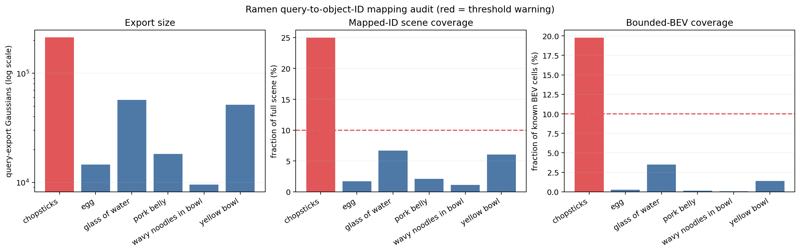
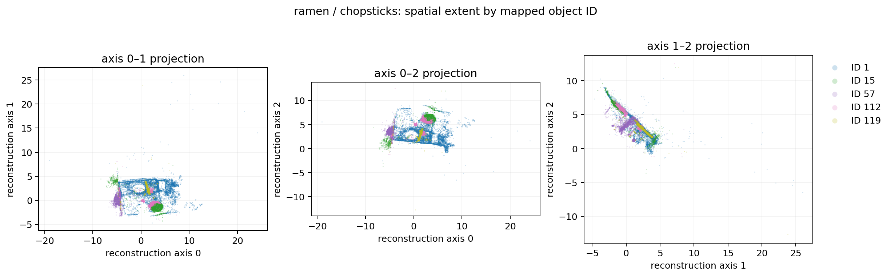

# Ramen open-vocabulary query-to-BEV bridge

## Purpose

This experiment processes six human-readable text queries with ILGS multi-view query-mask
voting. Five queries pass the automatic checks and four-view overlay review, while
`chopsticks` is rejected. Only accepted mappings appear in the named BEV. The experiment
does not reinterpret all 256 classifier indices as human semantic classes.

## Reproduce

```bash
python scripts/visualize_named_query_bev.py \
  --input outputs/ramen_full_semantic/semantic_occupancy.npz \
  --mapping configs/ramen_query_mapping_status.json \
  --output docs/assets/ramen_named_query_bev.png \
  --summary outputs/ramen_full_semantic/named_query_bev_summary.json
```

The input occupancy archive is generated by the frozen command in
[`full_scene_semantic_result.md`](full_scene_semantic_result.md). It is excluded from Git
because it is a large derived artifact; the mapping config, summary and rendered figure are
versioned.

## Query mapping and bounded-BEV result

| Accepted query | Object IDs | Export Gaussians | Usable views | BEV cells | Cells at occupancy ≥ 0.5 |
|---|---|---:|---:|---:|---:|
| egg | 107, 109, 123, 238 | 14,529 | 4 | 95 | 85 |
| glass of water ⚠ | 53, 75, 129, 141 | 57,004 | 4 | 1,268 | 1,047 |
| pork belly | 120, 212 | 18,223 | 4 | 48 | 47 |
| wavy noodles in bowl | 28 | 9,563 | 4 | 28 | 26 |
| yellow bowl | 108 | 51,582 | 4 | 506 | 445 |

The 12 accepted IDs are visible in the bounded 200,000-Gaussian run and cover 1,945 of the
36,196 BEV cells with Gaussian evidence (5.37%). For `glass of water`, ID 141 has only one
supporting view; the query is accepted because the four complete overlays consistently
localize the glass, but the ID-level warning remains recorded.


## Interpretation boundaries

- `chopsticks` is excluded because its masks and overlays fail the quality review below.
- A candidate export is not considered accepted merely because its IDs are non-overlapping
  or its Gaussian count is plausible; both automatic statistics and overlays are required.
- A mapping means the query-mask export selected those object IDs; it is not a semantic OCC
  ground-truth label and does not establish per-class IoU or mIoU.
- The full-scene baseline keeps the top 200,000 Gaussians after filtering and uses the
  strongest individual Gaussian evidence for its hard label. It does not accumulate a dense
  `[X,Y,Z,256]` class tensor.
- The plot uses reconstruction axes. Axis 2 has not been calibrated as gravity/up, so this is
  an axis-reduced representation rather than a robot-frame navigation map.
- Cells without Gaussian evidence remain unknown, not free.

## Chopsticks diagnostic audit

The query-export count was checked against a fresh classifier pass over all 854,507 scene
Gaussians. Every query count matches the full-scene membership of its mapped IDs exactly,
so the large `chopsticks` result is not caused by export duplication or dropped rows.

| Diagnostic | Chopsticks result |
|---|---:|
| Fraction of all scene Gaussians | 24.97% |
| Fraction of bounded known BEV cells | 19.76% |
| Dominant ID | 1 |
| ID 1 Gaussians | 169,409 (79.40% of export) |
| Robust axis-0 span relative to scene | 63.59% |



The reconstruction-coordinate projections below separate the five selected IDs spatially;
they are not gravity-aligned views and do not identify a physical object by themselves.



ID 1 was the first contamination candidate. Excluding it left IDs 15, 57, 112 and 119,
totaling 43,961 Gaussians and 908 cells in the bounded BEV. The four-view review rejected
that candidate as well:

- view 3 contributes 175,751 of 184,238 total mask pixels (95.39%) and its query mask
  visibly covers broad table/background regions;
- IDs 15, 57 and 112 receive votes only from that failed view;
- ID 119 receives votes from views 0–2, but its overlays highlight unrelated cups and a
  distant noodle plate rather than consistently localizing the main-scene chopsticks.

The final decision is to exclude `chopsticks` from the named BEV until its per-view 2D masks
are regenerated or manually corrected. The frozen decision record is in
`configs/ramen_chopsticks_audit.json`, with the compact review evidence in
`outputs/ramen_full_semantic/chopsticks_mask_vote_review.json`.

Server-side audit rerun:

```bash
python export_query_gaussians.py \
  -m output/lerf/ramen_refined_masks \
  --query "chopsticks" \
  --output_dir /media/cx/data/cxdata/ILGS_grasp_exports/lerf/ramen_refined_masks/iteration_30000/test/chopsticks_no_id1 \
  --exclude_ids 1 \
  --skip_normals
```

This rerun produced `mask_vote_summary.json` and four
`mask_vote_vis/*_rgb_query_selected.png` overlays used for the rejection decision.

## Reusable automatic gate

`scripts/audit_mask_vote_quality.py` checks dominant-view share, retained vote coverage and
cross-view ID support. It can automatically reject a degenerate distribution, but it never
automatically accepts semantics: non-rejected results remain `needs-visual-review` until the
overlays are inspected. The `chopsticks` rerun triggers two rejection rules (95.39% dominant
view share and only 20.55% retained vote coverage) plus a weak cross-view-support warning.
The default thresholds are diagnostic engineering gates, not learned confidence calibration
or benchmark-derived semantic accuracy thresholds.

| Query | Dominant-view share | Vote coverage | Visual decision | Final |
|---|---:|---:|---|---|
| egg | 32.18% | 100% | accept | accept |
| glass of water | 36.18% | 100% | accept with ID 141 warning | accept |
| pork belly | 31.97% | 100% | accept | accept |
| wavy noodles in bowl | 37.12% | 100% | accept | accept |
| yellow bowl | 34.92% | 100% | accept | accept |
| chopsticks | 95.39% | 20.55% | reject | reject |

The downloaded audit archive is pinned by SHA-256 in
`outputs/ramen_full_semantic/query_quality_gate_summary.json`.
