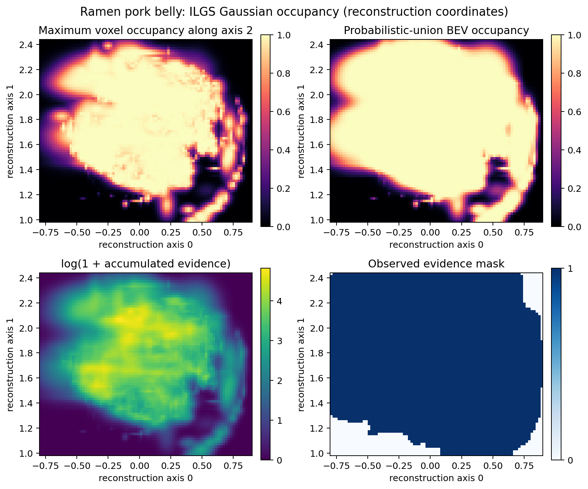

# Real ILGS export: ramen / pork belly

## Purpose

This run verifies that the repository can parse and voxelize a real ILGS query export,
not only the two-Gaussian synthetic example. It is an integration result without occupancy
ground truth; therefore it must not be reported as an OCC accuracy result.

## Input provenance

- Source artifact: query-isolated `target_gaussians_full.ply`, downloaded locally as
  `target.ply`.
- Source scene/query: ILGS `ramen` / `pork belly`.
- File size: 5,906,250 bytes.
- SHA-256: `6964e0eb137c243c807c19cfb1956cae72249d4e06c5f631a6c25e9b936defa0`.
- Source Gaussian count: 18,223.
- PLY schema: 81 fields, including 3 scales, 4 quaternion components, 16 object
  features and 3 semantic latent features.

The PLY itself is not committed because it is a generated research artifact. The hash and
machine-readable `outputs/ramen_pork_belly_real/summary.json` identify the exact input and run.

## Frozen run

```bash
python scripts/run_ilgs_ply.py \
  --ply /path/to/target.ply \
  --semantic-mode constant \
  --voxel-size 0.02 0.02 0.02 \
  --min-opacity 0.05 \
  --max-axis-scale 0.2 \
  --auto-grid-crop-quantile 0.01 \
  --output-dir outputs/ramen_pork_belly_real

python scripts/visualize_occupancy.py \
  --input outputs/ramen_pork_belly_real/ilgs_occupancy.npz \
  --output docs/assets/ramen_pork_belly_real_bev.png \
  --title "Ramen pork belly: ILGS Gaussian occupancy (reconstruction coordinates)"
```

Rationale:

- `opacity >= 0.05` removes very weak splats.
- `max axis scale <= 0.2` removes 25 extreme-scale splats after opacity filtering.
- The source contains a small number of spatial outliers. The automatic grid uses the
  1st–99th percentile of Gaussian centers plus 3σ padding based on the 99th-percentile scale.
- `semantic-mode constant` is correct for this already query-isolated target. The three
  `semantic_*` fields remain ILGS latent features and are not treated as class logits.

## Result

| Item | Value |
|---|---:|
| Gaussians after opacity/scale filtering | 14,919 |
| Gaussian centers inside grid | 14,726 |
| Grid bounds | `[-0.80, 0.98, 1.66]` to `[0.90, 2.44, 3.00]` |
| Voxel size | `0.02 × 0.02 × 0.02` reconstruction units |
| Grid shape | `85 × 73 × 67` |
| Total voxels | 415,735 |
| Occupied voxels at 0.5 | 44,097 |
| Voxels with evidence | 183,918 |
| BEV cells with evidence | 5,574 |



## Interpretation boundaries

- Axes and voxel size are in the ILGS reconstruction coordinate system. No metric scale,
  gravity alignment or robot extrinsic calibration was available for this run.
- “BEV” here means reduction along reconstruction axis 2, not a verified gravity-aligned
  robot bird's-eye view.
- Gaussian overlap makes probabilistic-union occupancy saturate in dense regions. The
  max-height and evidence panels are included to expose this behavior rather than hide it.
- A cell without Gaussian evidence is unknown, not free. Free-space supervision still needs
  calibrated camera/depth rays.
- There is no occupancy ground truth in this query export, so no IoU/mIoU claim is made.

